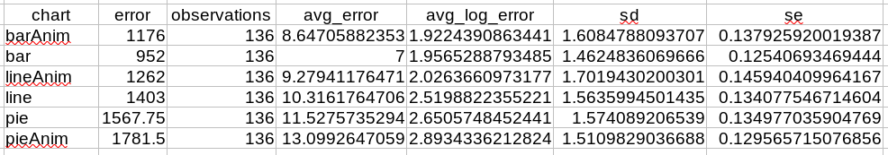
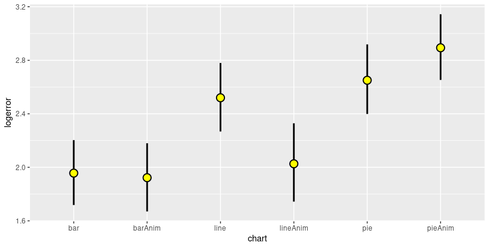

Assignment 3 - Replicating a Classic Experiment  
===

**Ashish Gurung 
Aaron Haim 
Stephanie Strom **

Experiment Description
---

For our experiment, we compared bar charts, pie charts, and line charts. We added the additional experimental condition of comparing static charts to charts that transition upon opening. Each survey consisted of 24 trials, each of the six chart types appeared four times in random order. Each chart was a visualization of 10 random data points. For the transitioning charts, the charts first appear with all data points as equal and then transition to their random value. We thought this was an interesting question to see if there was any difference in accuracy with a transition on opening. Pictured below are screenshots of the six different charts.

### Bar Chart

### Pie Chart

### Line Chart

### Bar Chart with Transition

### Pie Chart with Transition

### Line Chart with Transition

Experiment Results
---
 Here are the Hypothesis we wanted to test:
  * Does line chart facilitate the interpretation of data more effectively than bar and pie charts?
  * Does the use of animation improve the user performance while interpreting data?

### Ranking the Charts

From our dataset, we were able to observe something rather interesting, the average error (|judged percent - true percent|) was lower on the bar condition than the bar with animation condition. However, when we calculated the log base 2 of the error using the formula that Cleveland and McGill used in their original experiment to measure accuracy. The bar with Animation had a higher accuracy than the bar condition. This was an interesting finding that could indicate how accuracy is sensitive to readings that are closer to 0. 

Finally, we analyzed the charts using bootstrapped 96\% confidence intervals, and the chart from the analysis is below:

Analyzing the chart shows that the users' performance increased with the animate condition for the line and bar chart but regressed in the pie chart condition. So it can enhance performance for charts where the users already perform at a higher level. Analyzing line vs. line with animation is indicative of improving performance, but the difference is not significant. In this experiment's context, the static line chart is not a good alternative to bar charts. However, if we must utilize line charts for some reason, then animating them will make users' performance using the bar, bar with animation and line with animation comparable. The chart also indicates that although there isn't a significant difference between line, pie, and pie with animation, animation makes line chart significantly better than pie charts and pie charts with animations.

### Technical Achievements
- **Database Connection**: We deployed our experiment online and it can be accessed through the following link.
[Link to the experiment](https://internal.assistments.org/LiveChart/experimentindex)
The webpage is hosted on a server at WPI. 
We are using Spring, the pages are hosted using JSP, the API is RESTful and the data is stored ina Postgres DB.
- **No Redundancy**: The data collection stored the comparison values on the points as to limit the amount of redundant data. It also made it easier to calculate the size percentage between the two selected points.

### Design Achievements
- **Transitions:** We used transitions on the bar, pie, and line charts as a unique condition to test. This also provided a coding challenge in d3.
- **Simplistic UI**: The UI followed the simplistic design principles as to not influence the users in any fashion and pull away from the experiement. Only key requirements were highlighted for user understanding.

### References
- [https://www.d3-graph-gallery.com/graph/pie_basic.html](https://www.d3-graph-gallery.com/graph/pie_basic.html)
- [https://www.tutorialsteacher.com/d3js/create-pie-chart-using-d3js](https://www.tutorialsteacher.com/d3js/create-pie-chart-using-d3js)
- [https://bl.ocks.org/mbostock/1346410](https://bl.ocks.org/mbostock/1346410)
- [https://bl.ocks.org/gordlea/27370d1eea8464b04538e6d8ced39e89](https://bl.ocks.org/gordlea/27370d1eea8464b04538e6d8ced39e89)
- [https://jsfiddle.net/elangobharathi/Lqbcye5u/5/](https://jsfiddle.net/elangobharathi/Lqbcye5u/5/)
- [https://www.d3-graph-gallery.com/graph/line_basic.html](https://www.d3-graph-gallery.com/graph/line_basic.html)
- [https://www.d3-graph-gallery.com/graph/line_change_data.html](https://www.d3-graph-gallery.com/graph/line_change_data.html)
- [https://www.tutorialsteacher.com/d3js/create-bar-chart-using-d3js](https://www.tutorialsteacher.com/d3js/create-bar-chart-using-d3js)
- [https://www.d3-graph-gallery.com/graph/barplot_basic.html](https://www.d3-graph-gallery.com/graph/barplot_basic.html)
