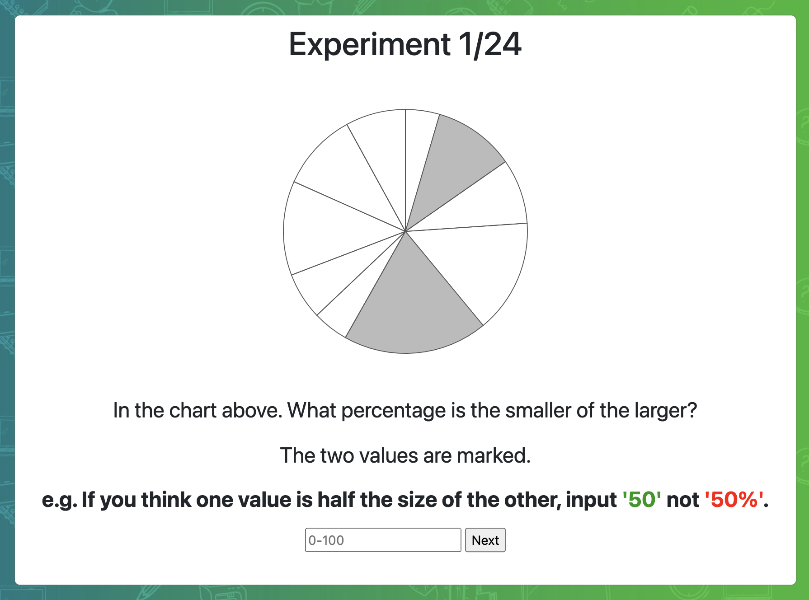
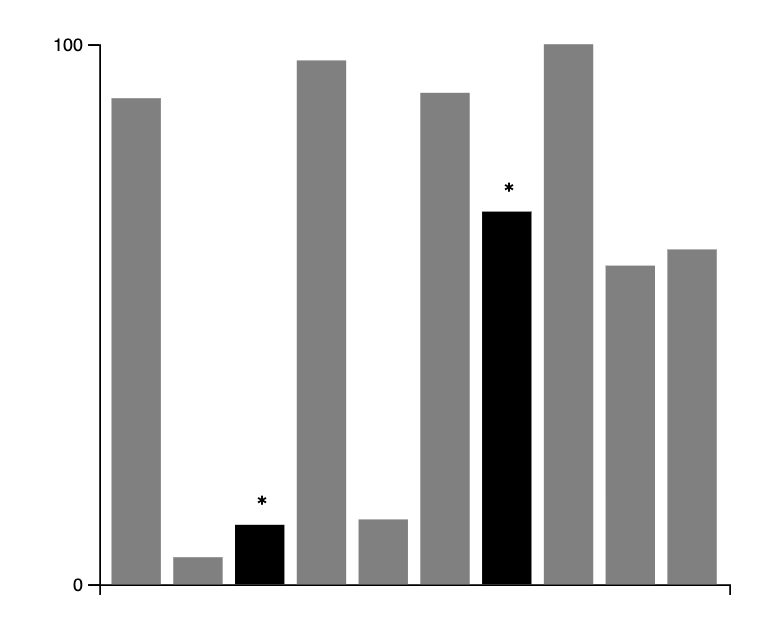
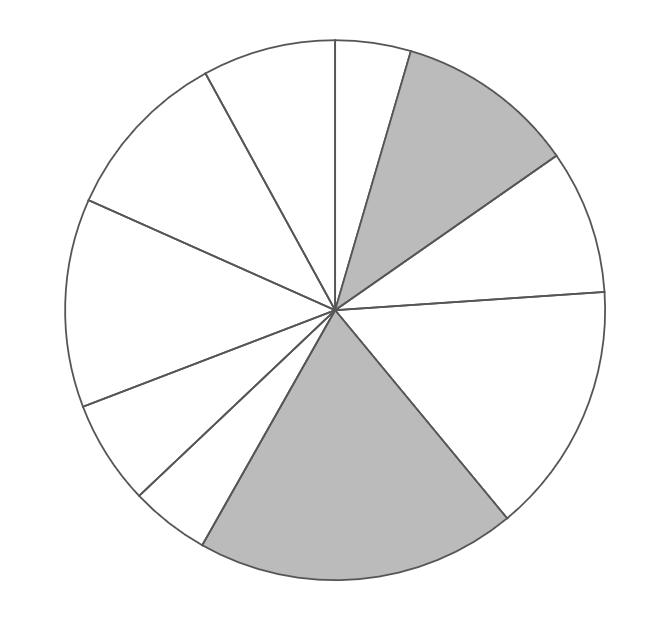
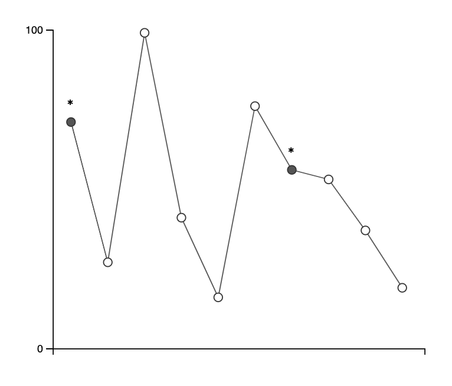
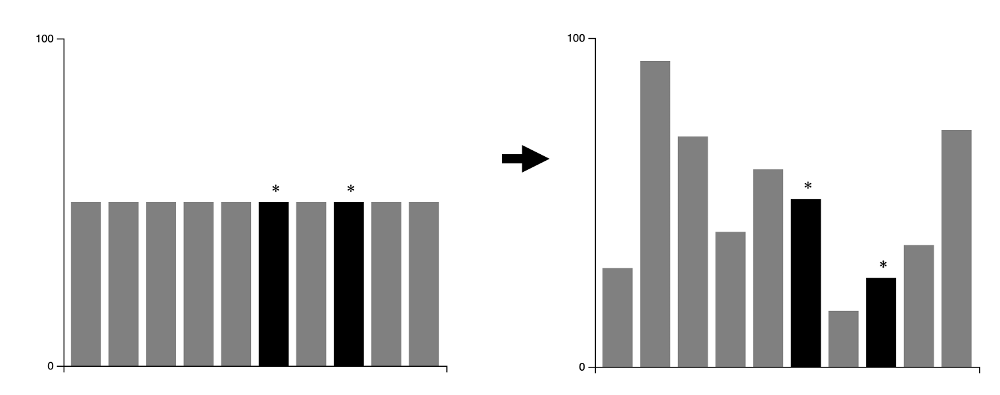
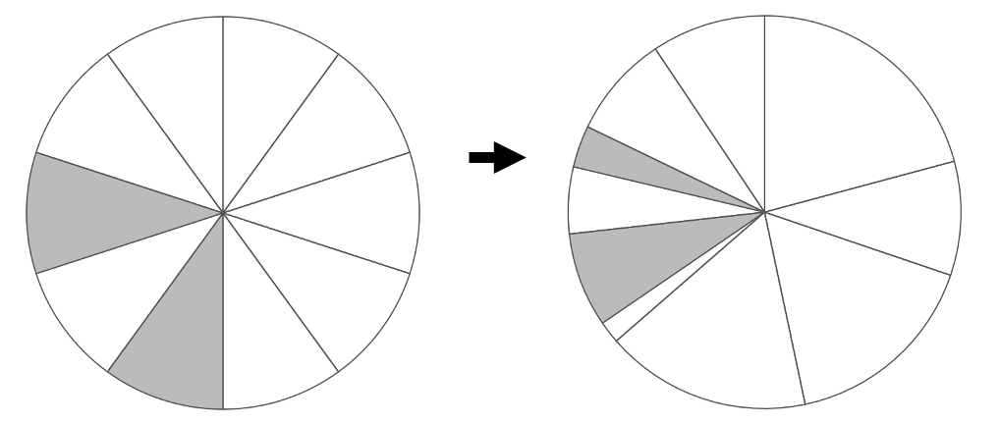
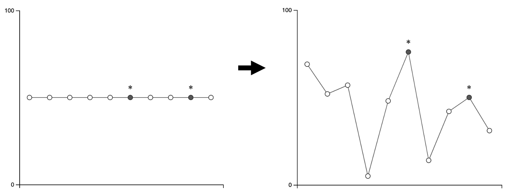

Assignment 3 - Replicating a Classic Experiment  
===

**Ashish Gurung 
Aaron Haim 
Stephanie Strom **

Experiment Description
---

For our experiment, we compared bar charts, pie charts, and line charts. We added the additional experimental condition of comparing static charts to charts that transition upon opening. Each survey consisted of 24 trials, each of the six chart types appeared four times in random order. Each chart was a visualization of 10 random data points. For the transitioning charts, the charts first appear with all data points as equal and then transition to their random value. We thought this was an interesting question to see if there was any difference in accuracy with a transition on opening. Pictured below are screenshots of the six different charts.

### Bar Chart

### Pie Chart

### Line Chart

### Bar Chart with Transition

### Pie Chart with Transition

### Line Chart with Transition

Experiment Results
---

### Technical Achievements
- 

### Design Achievements
- **Transitions:** We used transitions on the bar, pie, and line charts as a unique condition to test. This also provided a coding challenge in d3.

### References
- [https://www.d3-graph-gallery.com/graph/pie_basic.html](https://www.d3-graph-gallery.com/graph/pie_basic.html)
- [https://www.tutorialsteacher.com/d3js/create-pie-chart-using-d3js](https://www.tutorialsteacher.com/d3js/create-pie-chart-using-d3js)
- [https://bl.ocks.org/mbostock/1346410](https://bl.ocks.org/mbostock/1346410)
- [https://bl.ocks.org/gordlea/27370d1eea8464b04538e6d8ced39e89](https://bl.ocks.org/gordlea/27370d1eea8464b04538e6d8ced39e89)
- [https://jsfiddle.net/elangobharathi/Lqbcye5u/5/](https://jsfiddle.net/elangobharathi/Lqbcye5u/5/)
- [https://www.d3-graph-gallery.com/graph/line_basic.html](https://www.d3-graph-gallery.com/graph/line_basic.html)
- [https://www.d3-graph-gallery.com/graph/line_change_data.html](https://www.d3-graph-gallery.com/graph/line_change_data.html)
- [https://www.tutorialsteacher.com/d3js/create-bar-chart-using-d3js](https://www.tutorialsteacher.com/d3js/create-bar-chart-using-d3js)
- [https://www.d3-graph-gallery.com/graph/barplot_basic.html](https://www.d3-graph-gallery.com/graph/barplot_basic.html)
