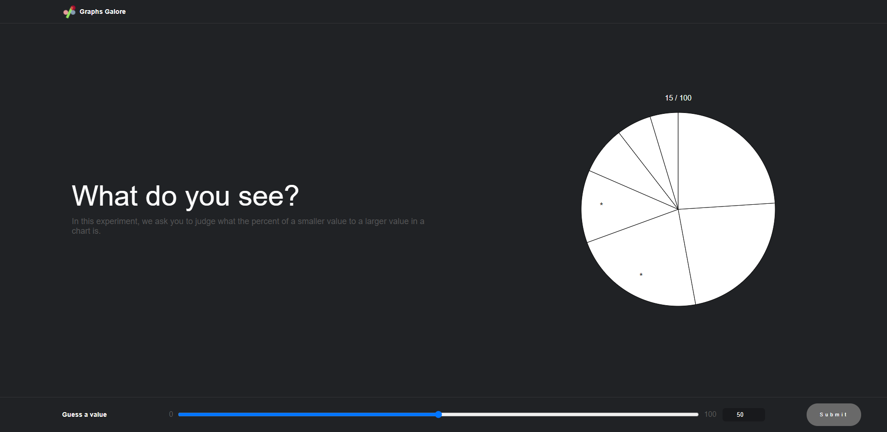
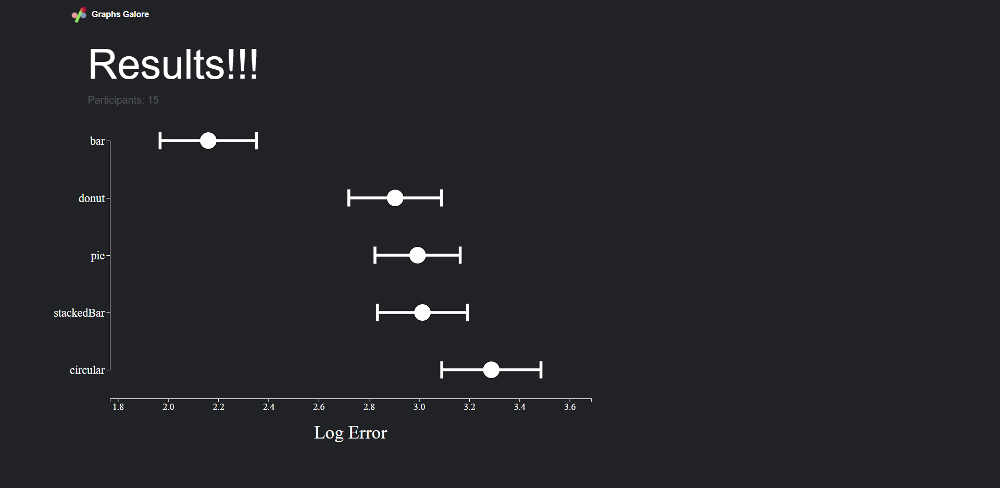
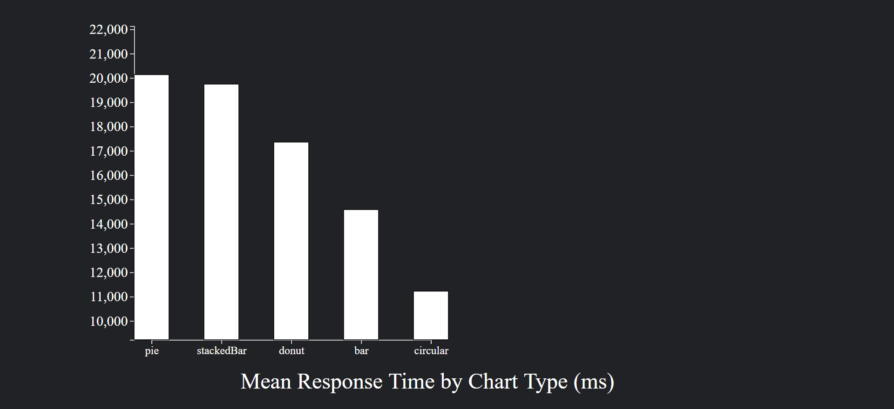
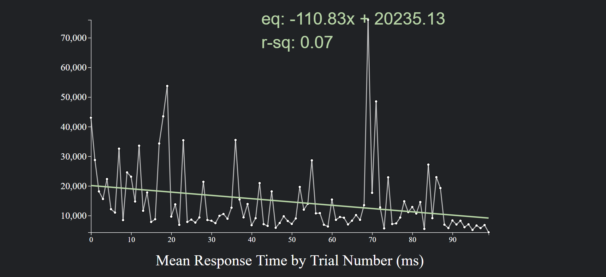
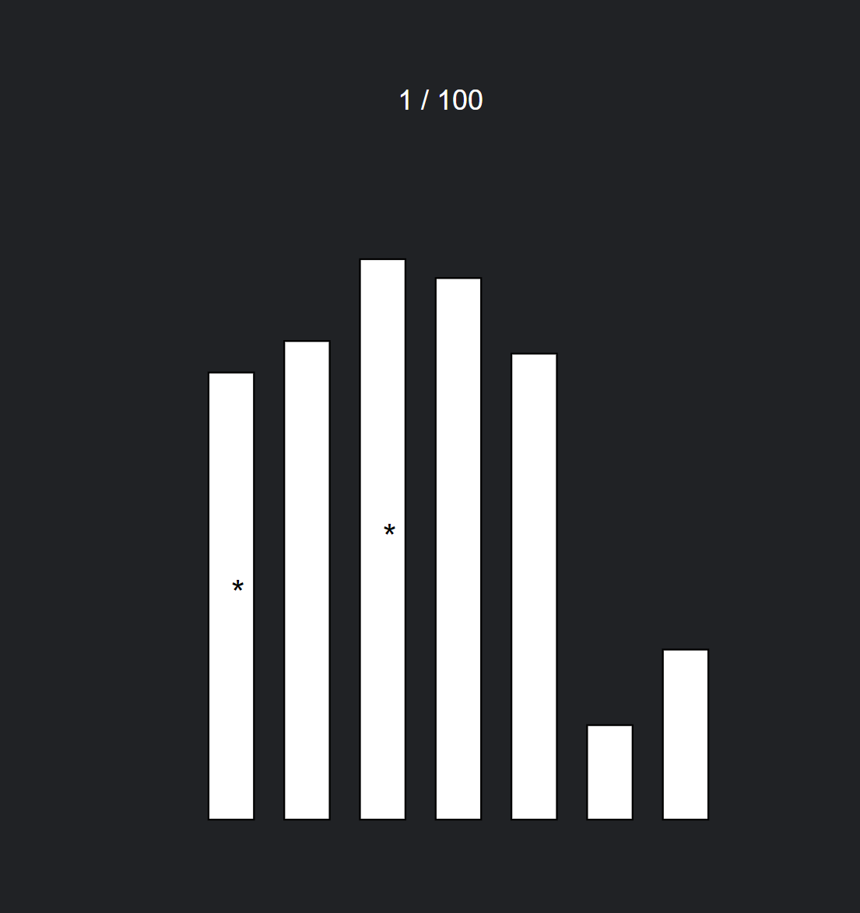
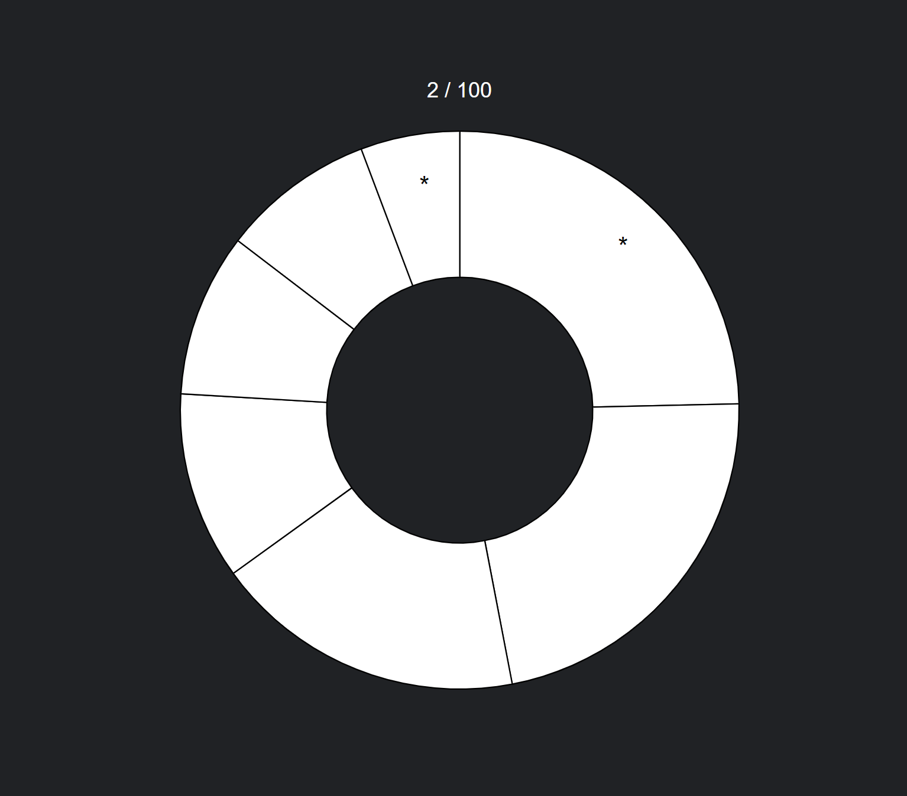
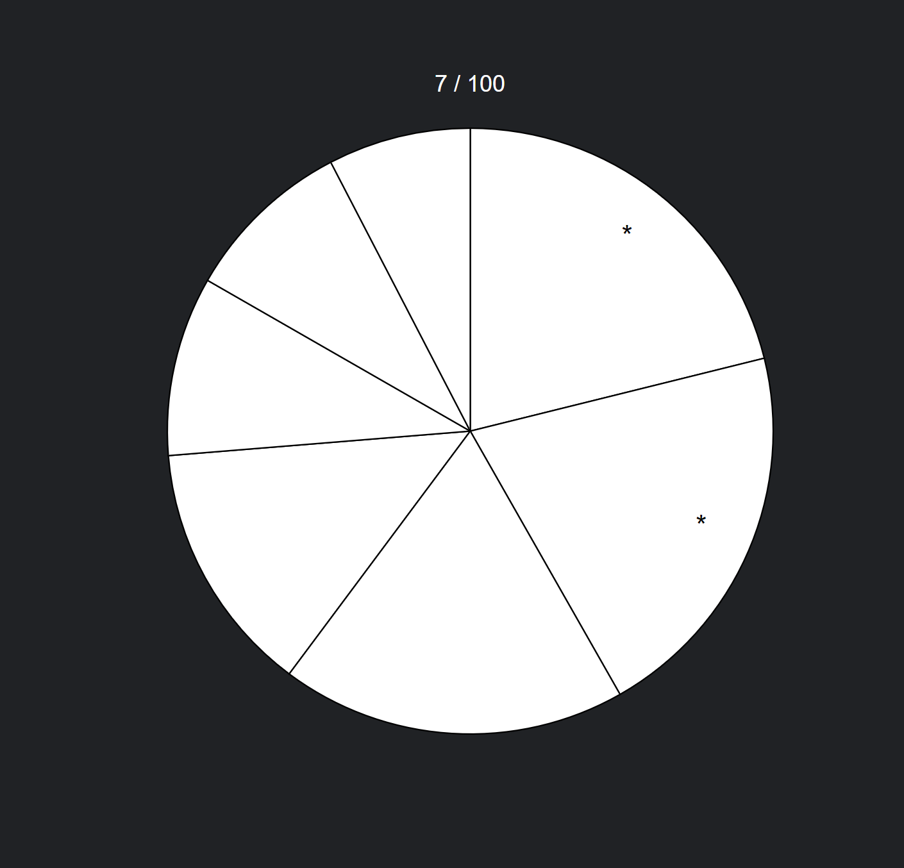
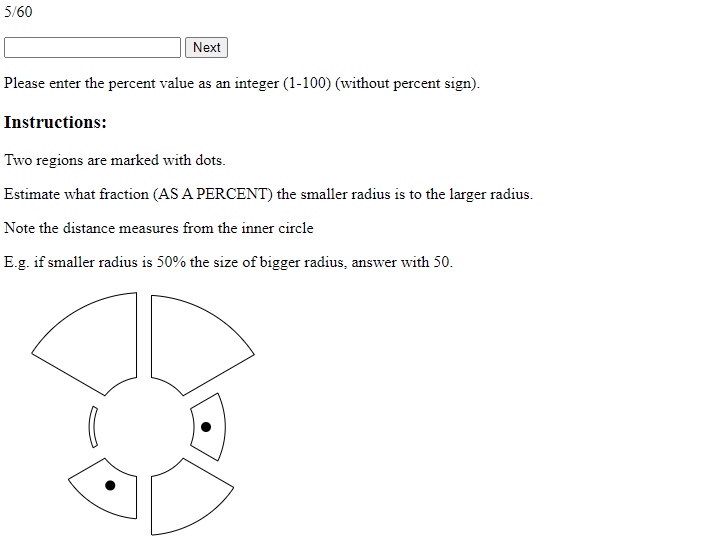

# Assignment 3 - Replicating a Classic Experiment

*Ryan LaMarche, Junying Li, Jason King & Micheal Osei*

## Experiment link:

https://data-viz-experiment.ryanlamarche.dev/

## Results link: 

https://data-viz-experiment.ryanlamarche.dev/results.html

## Concise description and screenshot

In 1984, William Cleveland and Robert McGill published the results of several controlled experiments that pitted bar charts against pies and stacked-bar variants. Their paper (http://www.cs.ubc.ca/~tmm/courses/cpsc533c-04-spr/readings/cleveland.pdf) (http://info.slis.indiana.edu/~katy/S637-S11/cleveland84.pdf) is considered a seminal paper in data visualization. 
In particular, they ran a psychology-style experiment where users were shown a series of randomly-generated charts with two graphical elements marked. Participants were then asked, "What percentage is the smaller of the larger?". This was repeated hundreds of time with varying data and charts. 

In this program, we re-implemented this controlled experiment and analyzed our results. All visualizations in this experiment are build with d3.js.

We added 5 types of charts to our experiment, including bar chart, pie chart, donut chart, stacked bar chart, and circular bar chart. Each type of charts show up 20 times per trail.

In addition, we have a result page. Log error, mean response time by chart type, and mean response time by trial number, are visualized in this page. 

*figure 1 - Welcome Page*

*figure 2 - Experiment Page*

*figure 3 - Log Error*

*figure 4 - Mean Response Time by Chart Type*

*figure 5 - Mean Response Time by Trial Number*

*figure 6 - Bar chart*

*figure 7 - donut chart*

*figure 8 - pie chart*

*figure 9 - stacked bar chart*

*figure 10 - circular bar chart*

## Result analysis

### Overview

According to our result, it's easy to figure out that bar chart has the least log error, which is what we expected. The donut chart, pie chart, and stacked bar chart all performed worse than the standard bar chart for comparison tasks, but performed very similarly to each other. The circular bar chart performed the worst out of all of them, but not by a large margin. Moreover, it's interesting to find that circular bar chart has the least response time.

While there are many outliers in the data, according to figure 5, the result also indicates that the user response time decreases as the trials go on.

### Bar chart

Bar chart performed best in all these five types of charts. It has the least log error, and second least user response time.

### Stacked bar chart

Stacked bar chart performed surprisingly bad. Its log error and user response time are pretty similar to pie chart, although they look very different.

### Circular bar chart

Circular bar chart performed the worst in log error, but best in user response time. This is a pretty interesting discovery.

### Pie chart

Pie chart performed worse than bar chart in log error, but better than circular char chart. It also performed worst in user response time.

### Donut chart

Donut chart performed similar to pie chart but slightly better than it in both log error and user response time, which is reasonable because they look similar too. 

## Technical achievements

- Response time recorded for each trial.

- Node.js & Typescript server.

- Store data in MongoDB.

## Design achievements

- Result visualizations.

We visualized our results, just like Cleveland and McGill did in their paper. We can compare the log error and user response time of each type of charts much easier.

- 5 chart types.

We made 5 types of charts in this experiment, which is more than required.

- Using a slider to input result.

In addition to input result by keyboard directly, we added a slider. Thus, users can input result with simply one click on the slider. 

