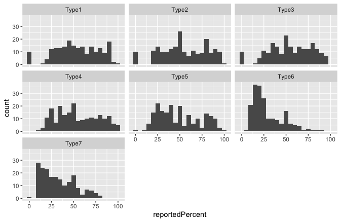
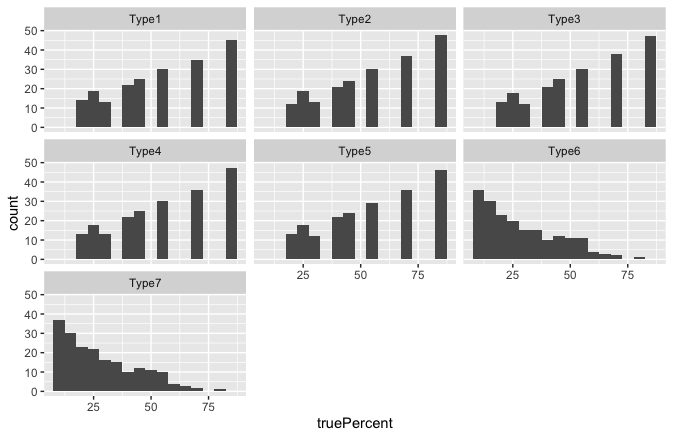
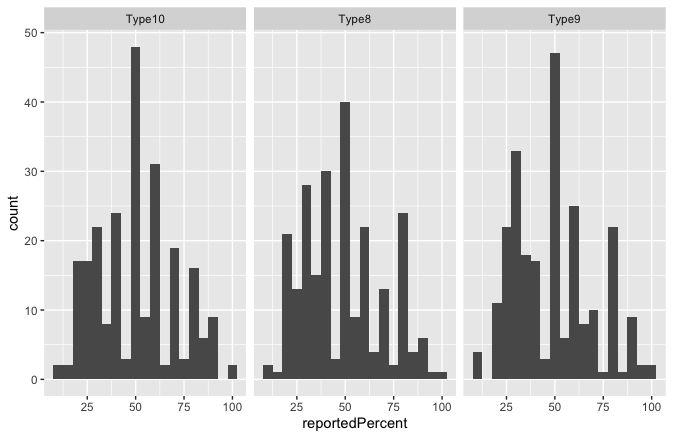
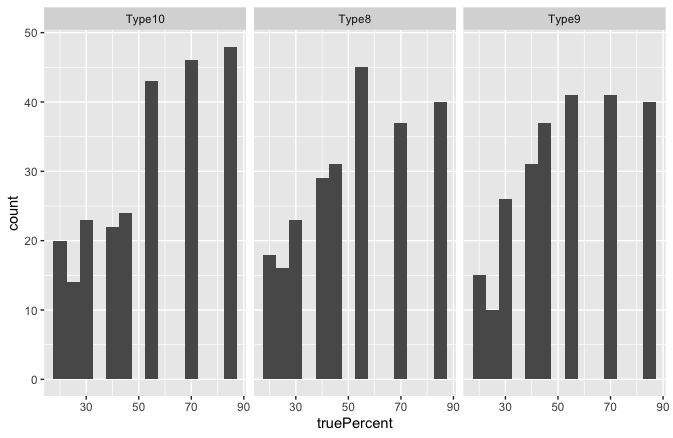

Assignment 3 - Replicating a Classic Experiment  
===
Introduction
---
There are two experiments in our assignment.
- Classical experiment   
As the experiments in Cleveland paper are so classical and fundamental in the history of data visualization, our group replicated experiments in Cleveland paper first. Bar charts, pie charts, stacked bar cahrts are included in our survey.  
   *Github page: https://zihao777.github.io/03-experiment/*  
   *Website: http://47.242.141.68:8000*  
- Radial experiment   
   As an extra part, we want to figure out whether people have a good quantitative cognition for radial bar chart. In general speaking, we designed 3 types of radial bar chart. Each one has 3 bars, 5 bars, 7 bars.  
  *Github page: https://zihao777.github.io/03-experiment/extra/*   
  *Website:  http://47.242.141.68:8000/extra*    
  
To collect the data, we rent a server to deploy our page. Node.js is used to response, required on server, and connect database. The database is managed by MongoDB. All charts are drawn by D3.js.

Experiment
---
### Classical experiment
Classical experiment is consisted with two parts: position-length experiment and position-angle experiment. There are 70 trails and the trails are in random order. In each graph, two bars or areas are marked with a black dot and users need to judge which what percent the smaller to big one. The first page is an instruction page that user can agree us to collect data form them or disagree.
     
- In part-one, users were shown the five types of graphs which are named TYPE1, TYPE2, TYPE3, TYPE4, TYPE5 shown in the below table. Ten groups of data are generated for each type of graph, so part-one has 50 graphs. Each graph is either a bar chart or stacked bar chart.  
As illustrated in Cleveland paper, for the grouped bar chart, the dots appeared either in the second and third bars in second group or in the second bars of the two groups. For the stacked bar chart, dots appeared either in the top divisions of two bars or top two divisions of left bar or bottom divisions of two bars.   
The values involved in the user's judgments were show below: 
 
The values of bar chart not involved in the users' judgments are randomly generated from 0 to 100. The values of stacked bar chart not involved in the users' judgments are randomly generated from 0 to 30 or 0 to 20. All values are shown in a same scale on the page.  
    
- In part-two, users were shown the two types of graphs which are named TYPE6, TYPE7 shown in the below table. Same with part-one, ten groups of data are generated for each type of graph, so part-two has 20 graphs.   
In this part, each group of  values is generated randomly and can be sumed up to 100. They also ,eet the three requirments in Cleveland paper: The minimum value had to be greater than 3; the maximum value had to be less than 39 and all differences between values in a group had to be greater than 0.1. The values which have the biggest value and smallest value will be marked with black dot.

|Name|Type|Name|Type|Name|Type|
|----|----|----|----|----|----|
|TYPE1||TYPE2||TYPE3||
|TYPE4||TYPE5||TYPE6||
|TYPE7||||

### Radial experiment
- There are 60 trails and the trails are in random order. In each graph, two bars are marked with a black dot and users need to judge which what percent the smaller to big one. The first page is an instruction page that user can agree us to collect data form them or disagree.  
In this experiment, users were shown the three types of graphs which are named TYPE8, TYPE9 and TYPE10 shown in the below table. Twenty groups of data are generated for each type of graph, so part-two has 20 graphs.  
Which bar is marked with black dot is randomly and values involved in the user's judgments were show below: 
 
The values not involved in the users' judgments are randomly generated from 20 to 100. All values are shown in a same scale on the page.  

|Name|Type|Name|Type|Name|Type|
|-|-|-|-|-|-|
|TYPE8||TYPE9||TYPE10||

Analysis
---

### Error Trial 1
In our experiment we were asked to find how different charts could be interpreted by different users. As we have learned in our classroom experience, pie charts are not great tools for representing data. Much to our surprise, we found that the log error was negative for the pie chart. This meant that many of the users input values that were very close to the true percentage. While pie charts had the greatest distribution of error, it was still the most well-interpreted chart compared to bar and stacked. 

 

- As you can see in the image above, most users had a very difficult time reading stacked bar charts with most error values between 2.5 and 2.75. 
- The pie chart error stretches from about 1.75, partially overlaps with the typical bar chart, and ends at just about 2.11.  
- The bar chart had the smallest range of error, as expected, however the average error was a bit over 2, while pie charts were found to be most successful with average error under 2.  
Because of the questionable data we found in this trial, we decided to pursue a second trial to compare.

### Error Trial 2
In our second trial

### Radial Analysis

### Overall 

## Normal Distribution

 
 
 
 

Achevements
---

## Technical Achievenment
- After recreating the classical experiment, we decided to pursue a third part involving radial charts. This type of graph is was not included in the classical experiment but is becoming an increasingly more popular way to represent data. We created 3 types of this chart, 3 bars, 5 bars, 7 bars, and wanted to determine if the number of bars influenced how accurate the reported percent was. This was an interesting component because creating a radial graph with d3 was a lot more complicated than anticipated causing multiple bugs before it came together. 
|TYPE8||TYPE9||TYPE10||

## Design Achievement
- On the web page, if the user accidentally clicks the Next button without entering a value, their page will send out an alert box to remind the user to enter the answer and null data can be avoided to send to server. In addition, at the top of the page, users can see which page they are currently on and a progress bar, allowing users to know their progress. 
  

- As a team we attempted a second design achievement for this project, how would using a dark gradient background change how the charts are interpreted? While we did not have enough time to collect sufficient data to test this achievement, the code is included in docs/pt3. 
 

